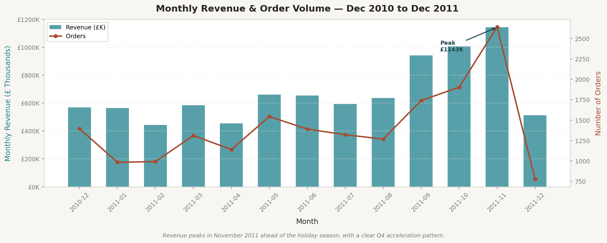
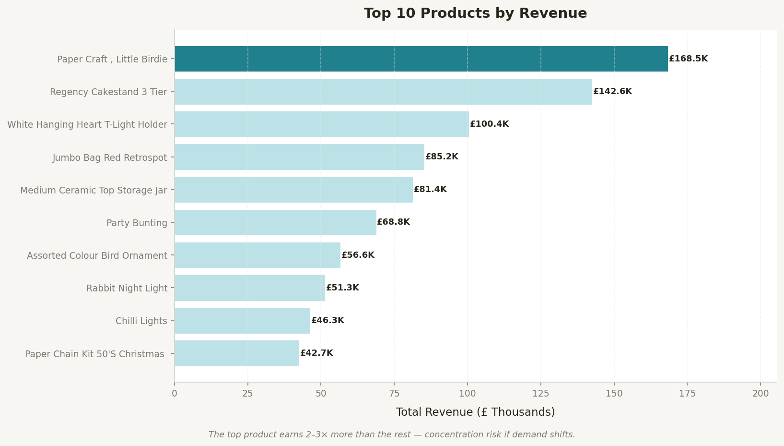
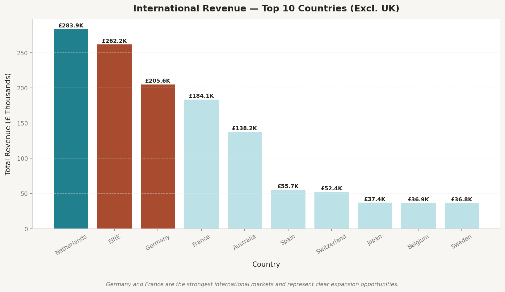
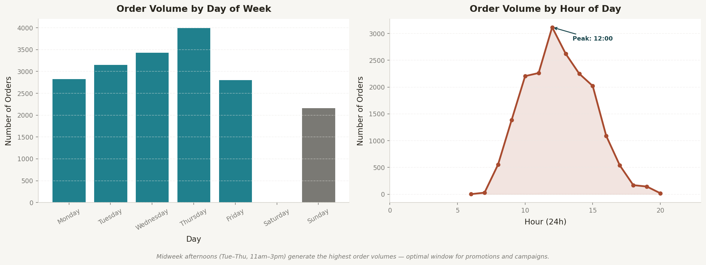
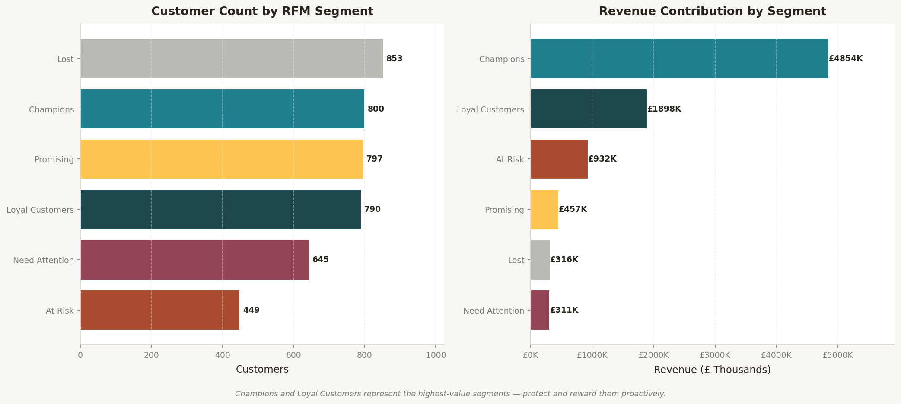
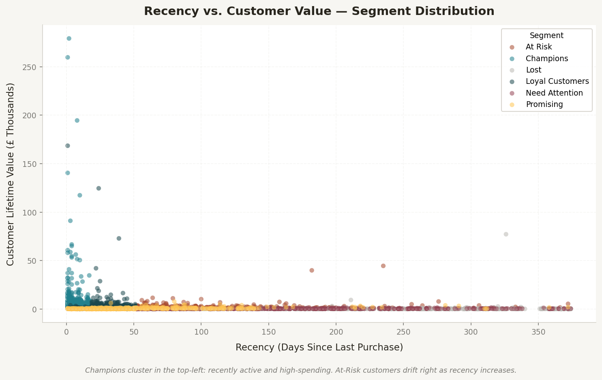
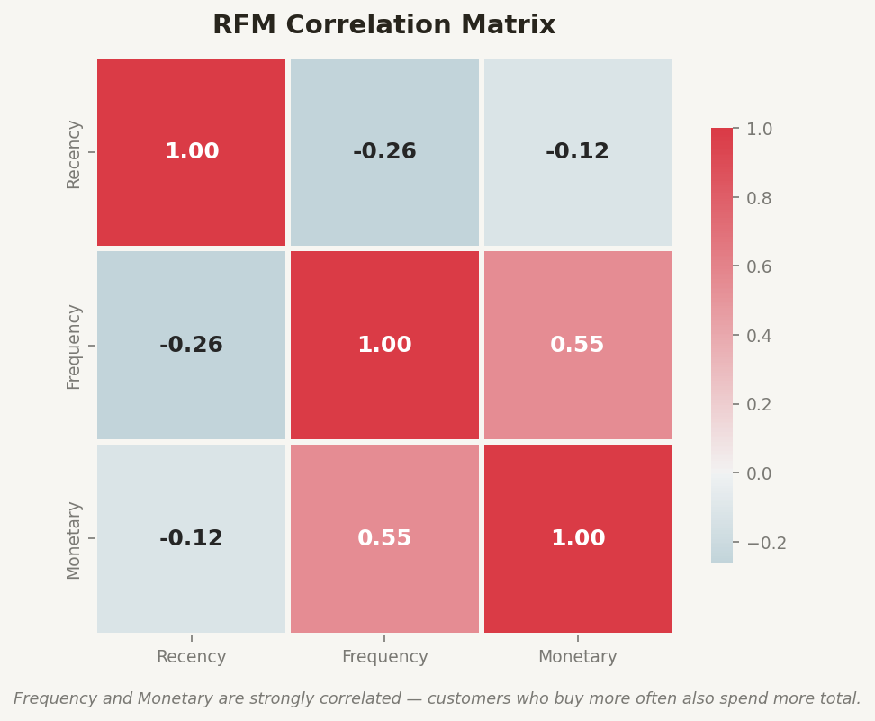
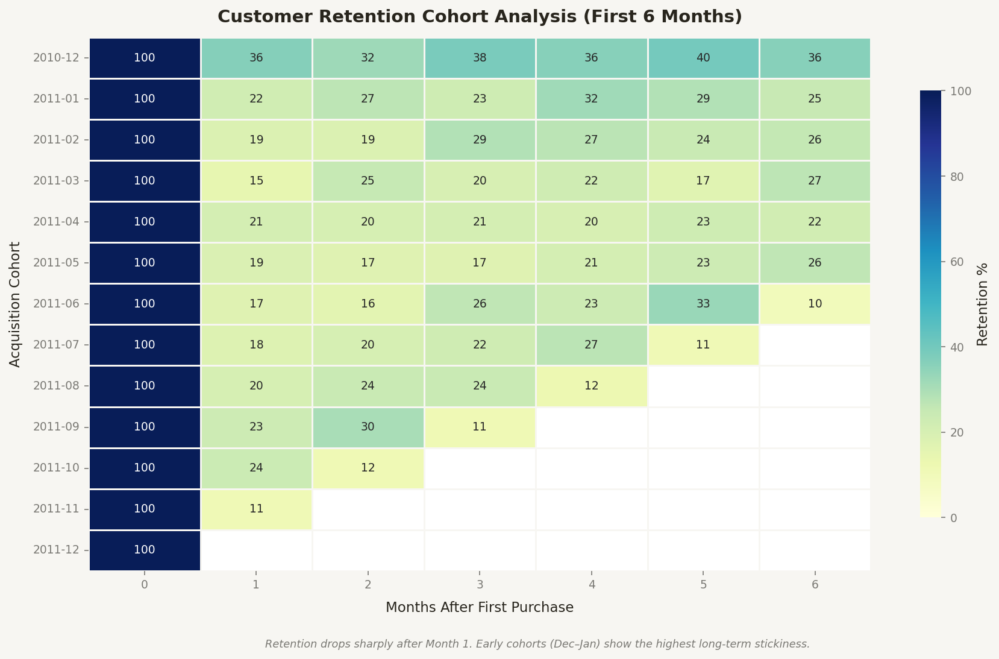
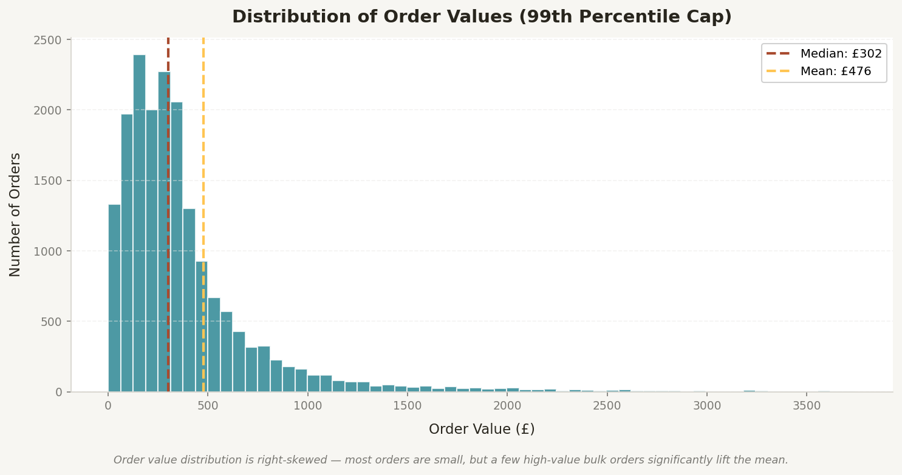

# UK Online Retail — End-to-End Business Analysis

<p align="left">
  
  
  
  
  
</p>

---

## Overview

This project performs a complete, end-to-end business analysis of a UK-based online gift retailer using 13 months of real transaction data. It covers the full analyst workflow — from raw data to strategic recommendations — and is structured the way a Business Analyst would approach a live client engagement.

The analysis answers six concrete business questions around revenue health, customer loyalty, product performance, geographic expansion, and marketing efficiency.

**Dataset:** [UCI Online Retail Dataset](https://archive.ics.uci.edu/dataset/352/online+retail) — 541,909 transactions across 37 countries (Dec 2010 – Dec 2011)

---

## Why This Project Matters

Most portfolio projects stop at charts. This one goes further — every finding is framed around a business impact, and every recommendation is tied to a specific action with an expected outcome.

The business questions driving this analysis are the same ones a Head of E-Commerce, Marketing Manager, or CFO would ask in a real planning meeting:

- Where is our revenue actually coming from, and how fragile is it?
- Which customers are about to stop buying — and can we get them back?
- Are we investing our marketing budget in the right places?
- What do our international numbers say about where we should grow next?

---

## Business Context

The company is a UK-registered non-store online retailer selling unique all-occasion gifts. Its customer base includes individual consumers and wholesale buyers across Europe and beyond. With £8.7M in annual revenue and no formal analytics function, the business was making operational and marketing decisions without visibility into the patterns driving (or eroding) that revenue.

---

## Problem Statement

The company lacked a systematic view of customer behaviour beyond raw transaction volume. It could not reliably identify which customers were at risk of churning, which products were carrying disproportionate revenue weight, or whether its marketing spend was aligned with actual buyer activity windows. This created a gap between data availability and decision-making quality.

---

## Objectives

- Define and calculate the core KPIs that measure business health
- Segment customers using the RFM framework to prioritise retention and re-engagement
- Analyse product and geographic revenue concentration
- Map buying behaviour by time to guide marketing scheduling
- Translate findings into actionable, prioritised recommendations

---

## Dataset Details

| Attribute | Value |
|-----------|-------|
| Source | [UCI Machine Learning Repository](https://archive.ics.uci.edu/dataset/352/online+retail) |
| Transactions (raw) | 541,909 |
| Transactions (cleaned) | 396,470 |
| Date Range | Dec 2010 – Dec 2011 |
| Unique Customers | 4,334 |
| Unique Products | 3,660 |
| Countries | 37 |
| Key Fields | InvoiceNo, StockCode, Description, Quantity, InvoiceDate, UnitPrice, CustomerID, Country |

---

## Tools & Technologies

| Tool | Purpose |
|------|---------|
| Python 3 | Core analysis language |
| pandas | Data loading, cleaning, transformation |
| matplotlib | Chart creation and layout |
| seaborn | Heatmaps and distribution plots |
| scikit-learn | RFM scoring (quantile-based segmentation) |
| Jupyter Notebook | Interactive analysis environment |
| GitHub | Version control and portfolio presentation |

---

## Project Workflow

```
Raw Data (541K rows)
       ↓
Data Cleaning & Validation
  • Remove anonymous sessions (no CustomerID)
  • Remove cancellations (InvoiceNo prefix 'C')
  • Filter invalid quantities and prices
  • Strip internal/test stock codes
       ↓
Feature Engineering
  • Revenue = Quantity × UnitPrice
  • YearMonth, DayOfWeek, Hour derived from InvoiceDate
       ↓
KPI Framework Definition
       ↓
Exploratory Data Analysis
  • Revenue trends  • Product performance
  • Geographic breakdown  • Behavioural patterns
       ↓
RFM Customer Segmentation
  • Score each customer on Recency, Frequency, Monetary
  • Classify into 6 actionable segments
       ↓
Cohort Retention Analysis
       ↓
Insights → Recommendations
```

---

## Key Analyses Performed

- **Revenue Trend Analysis** — Monthly revenue and order volume across 13 months, with peak identification
- **Product Performance** — Top 10 revenue-generating products and concentration analysis
- **Geographic Breakdown** — International revenue ranked by country, identifying expansion candidates
- **Behavioural Pattern Analysis** — Order volume mapped by day of week and hour of day
- **RFM Segmentation** — 4,334 customers scored and classified into Champions, Loyal, Promising, At Risk, Need Attention, and Lost
- **RFM Scatter Analysis** — Recency vs. Customer Lifetime Value plotted by segment
- **Correlation Analysis** — RFM dimension relationships quantified
- **Cohort Retention** — 13 acquisition cohorts tracked across 6 months to measure structural loyalty

---

## Business KPI Summary

| Metric | Value |
|--------|-------|
| Total Revenue | £8,767,753 |
| Total Orders | 18,405 |
| Unique Customers | 4,334 |
| Average Order Value | £476.38 |
| Repeat Customer Rate | 65.3% |
| Orders per Customer | 4.2 |
| UK Revenue Share | 82.9% |
| Champions Revenue Share | **55.4%** |
| At-Risk Recoverable Revenue | **£931,821** |

---

## Major Insights

**1 — Q4 Revenue Dependency is a Structural Risk**
November alone accounts for 13% of annual revenue. A single disrupted holiday season — supply issue, competitor move, or economic shock — would materially damage full-year results. The business has no visible early warning system for this.

**2 — Champions Generate 55% of All Revenue**
A small group of recently active, high-frequency, high-spend customers is responsible for over half the business. These customers are not being systematically retained or rewarded. If 10% of Champions churn, that is a six-figure hole in annual revenue.

**3 — 35% of Customers Never Return**
One-third of identifiable customers made exactly one purchase and never came back. The post-purchase experience — emails, product quality, communication — is not strong enough to convert first-time buyers into repeat customers.

**4 — £931K Sits in a Recoverable At-Risk Segment**
Customers who previously spent heavily have gone quiet. This segment carries nearly £1M in historical spend and proven willingness to buy. A targeted re-engagement campaign achieving a 15% conversion rate would recover approximately £140K in revenue.

**5 — International Markets Are Underdeveloped**
82.9% of revenue comes from the UK. Germany, Netherlands, and Ireland are buying without any targeted marketing investment. EU markets represent a low-friction expansion opportunity on existing infrastructure.

**6 — Marketing Budget Is Wasted on Weekends**
Order volumes on Saturday and Sunday are a fraction of midweek levels. The buyer profile here is predominantly B2B wholesale — orders happen during business hours, Tuesday through Thursday. Reallocating weekend ad spend to a Tue–Thu 10am–2pm window would improve return on ad spend immediately.

---

## Recommendations

### Short-Term (0–3 Months)

| Action | Target Segment | Expected Impact |
|--------|---------------|----------------|
| Launch Champions loyalty program (early access, exclusive offers) | Champions | Reduce churn risk on 55% of revenue |
| Deploy 3-email win-back sequence | At Risk | Recover ~£140K at 15% conversion |
| Shift ad budget to Tue–Thu 10am–2pm | All paid channels | 15–25% improvement in ROAS |
| Add Day 7 + Day 30 post-purchase emails | New customers | Lift one-time buyer conversion rate |

### Medium-Term (3–9 Months)
- Automate RFM segment tracking in CRM so marketing triggers fire when a Champion's score drops
- Begin Q4 planning in August — pre-Black Friday communications by October 15
- Bundle top-performing products to raise AOV from £476 toward £550+

### Strategic (9–18 Months)
- Invest in dedicated EU marketing campaigns — Germany, Netherlands, and France first
- Build a wholesale loyalty tier with volume pricing and account management
- Develop a seasonal demand forecasting model for inventory planning around November spikes

---

## Visualisations

### Monthly Revenue & Order Volume Trend


### Top 10 Products by Revenue


### International Revenue — Top 10 Countries (excl. UK)


### Order Behaviour — Day of Week & Hour of Day


### RFM Customer Segmentation — Count & Revenue


### Recency vs. Customer Lifetime Value


### RFM Correlation Matrix


### Customer Retention Cohort (First 6 Months)


### Order Value Distribution


---

## Key Skills Demonstrated

- **Data Analysis** — Cleaned and analysed 541,909 rows across 8 dimensions; handled 24.9% missing CustomerID rate with documented reasoning
- **Business Analysis** — Framed every finding around a business problem, not a statistical output
- **KPI Tracking** — Defined, calculated, and contextualised 8 core business metrics
- **Customer Segmentation** — Built a full RFM model scoring 4,334 customers across Recency, Frequency, and Monetary dimensions
- **Cohort Analysis** — Tracked 13 acquisition cohorts across a 6-month retention window
- **Data Visualisation** — Produced 9 publication-quality charts with consistent design and business-focused annotations
- **Stakeholder-Focused Recommendations** — Translated analysis into prioritised actions with owners, timelines, and estimated business impact
- **Problem Solving** — Identified £931K in recoverable revenue and a misdirected marketing budget without any prior hypothesis
- **Reporting** — Structured the entire project as a consulting-style case study, not a classroom exercise
- **Python (pandas, matplotlib, seaborn, scikit-learn)** — End-to-end pipeline from raw Excel to visualised insights

---

## Conclusion

This analysis turned 13 months of raw transaction logs into a strategic decision-support package. The most important finding is not a single number — it is the combination of revenue concentration risk (Champions hold 55% of revenue) and a large recoverable At-Risk pool (£931K), which together define where the business should focus its retention effort immediately.

The recommendations are deliberately sequenced by effort-to-impact ratio. The short-term actions require no new technology — just CRM execution and ad budget reallocation. The medium and strategic actions build on the analytical infrastructure established here.

---

## Repository Structure

```
uk-online-retail-analysis/
│
├── notebooks/
│   └── UK_Online_Retail_Analysis.ipynb   ← Main analysis notebook
│
├── visuals/
│   ├── 01_monthly_revenue_trend.png
│   ├── 02_top_products_revenue.png
│   ├── 03_revenue_by_country.png
│   ├── 04_orders_day_hour.png
│   ├── 05_rfm_segments.png
│   ├── 06_rfm_scatter.png
│   ├── 07_rfm_correlation.png
│   ├── 08_cohort_retention.png
│   └── 09_order_value_distribution.png
│
├── scripts/
│   └── analysis.py                       ← Standalone chart generation script
│
└── README.md
```

> **Data note:** The raw dataset (`Online Retail.xlsx`) is not included in this repository due to file size. Download it directly from the [UCI Machine Learning Repository](https://archive.ics.uci.edu/dataset/352/online+retail) and place it in a `data/` folder before running the notebook.

---

## How to Run

```bash
# 1. Clone the repository
git clone https://github.com/alwynfernandus/uk-online-retail-analysis.git
cd uk-online-retail-analysis

# 2. Install dependencies
pip install pandas matplotlib seaborn scikit-learn openpyxl nbformat jupyter

# 3. Download the dataset
# https://archive.ics.uci.edu/dataset/352/online+retail
# Save as: data/Online Retail.xlsx

# 4. Launch the notebook
jupyter notebook notebooks/UK_Online_Retail_Analysis.ipynb
```

---

## About

**Alwyn Fernandus**
MBA in Business Analytics 
Power BI · SQL · Python · Excel · Tableau · Alteryx · GitHub
📧 alwynfernandus123@gmail.com · [LinkedIn](https://www.linkedin.com/in/alwynfernandus)
